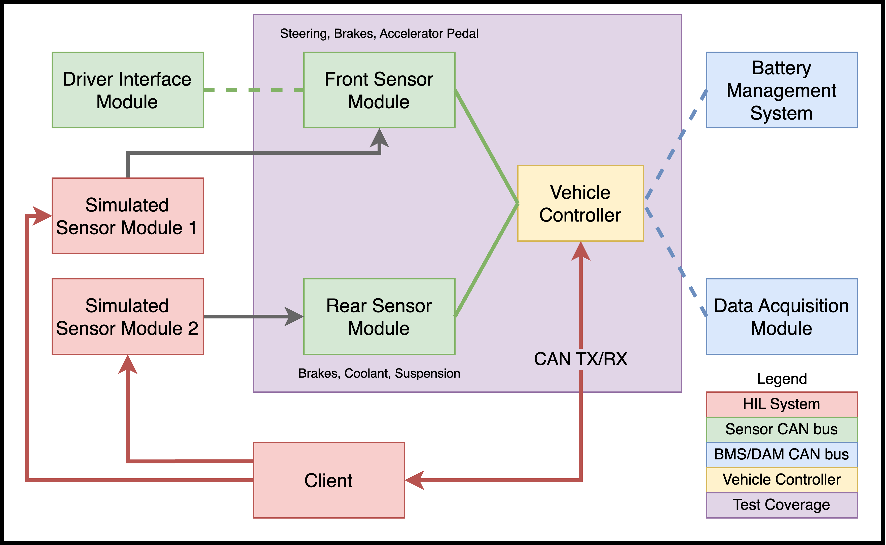

# Hardware In Loop 
Software used to simulate sensors and other endpoints of UBC Formula Electric's electrical system.


*System Diagram for the Quintuna UBC Formula Electric Vehicle (2024-2025)*

Install the package with:
```sh
pip install 'git+https://github.com/liam-ilan/formula-e-hil.git@main'
```

*For an example script, see [`./examples/example_setup.py`](./examples/example_setup.py)*

## How does it work?
The HIL system is split into two parts:
1) This repository, which contains the Hardware-In-Loop specific frontend.
2) The [Chimera V2 project](https://github.com/UBCFormulaElectric/Consolidated-Firmware/tree/master/firmware/chimera_v2), a system to command our custom C-programmed boards with Python.

We have two interfaces to "Mock" the car's surroundings.
- Simulated Sensor Modules - boards designed to to mock sensor inputs (ie. Brakes, Accelerator Pedals, Suspension Travel).
- CAN - On the Quintuna vehicle, we have three CAN busses, we can tap into these busses to send mock signals from the BMS, inverters, and dashboard.

We use [Chimera V2](https://github.com/UBCFormulaElectric/Consolidated-Firmware/tree/master/firmware/chimera_v2) to control the Simulated Sensor Modules - all logic to control these devices lives on the Python-side.

## Development
This repo is a [Poetry](https://python-poetry.org/) project. Make sure you have it installed.

To install dependencies, run
```sh
poetry install
```

To format/check, run
```sh
poetry run ruff format && poetry run ruff check
```

## Credit
- [Jaelyn Wan](https://www.linkedin.com/in/jaelyn-wan/), Simulated Sensor Module hardware.
- [Liam Ilan](https://www.liamilan.com/), core software, Chimera V2, HIL frontend.
- [Setare Maleki](https://www.linkedin.com/in/setare-maleki/), USB CDC device-side drivers and initial Pyusb interface.

*A [UBC Formula Electric](https://www.ubcformulaelectric.com/) project 🏎️ 🇨🇦*
